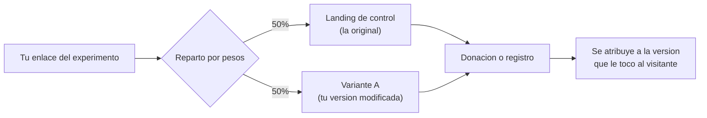
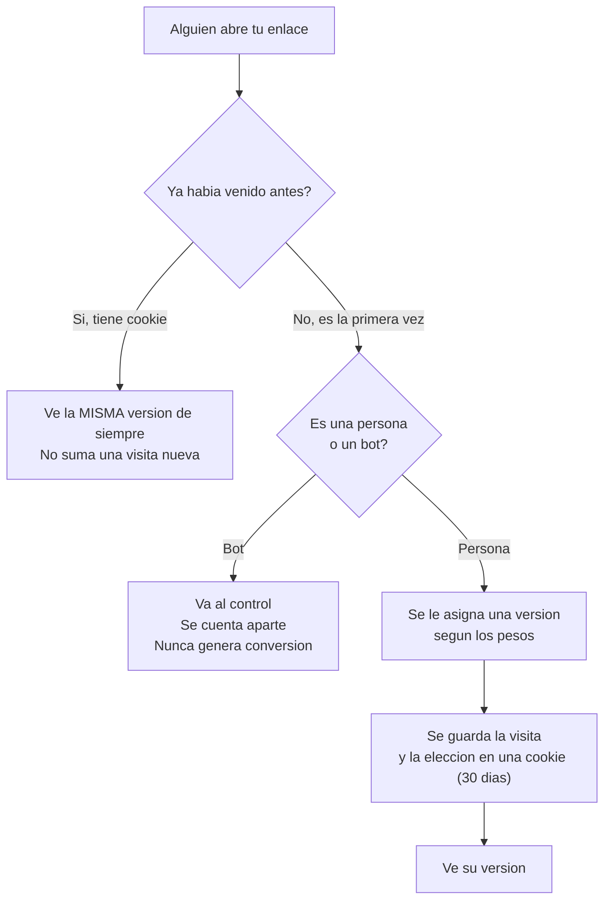
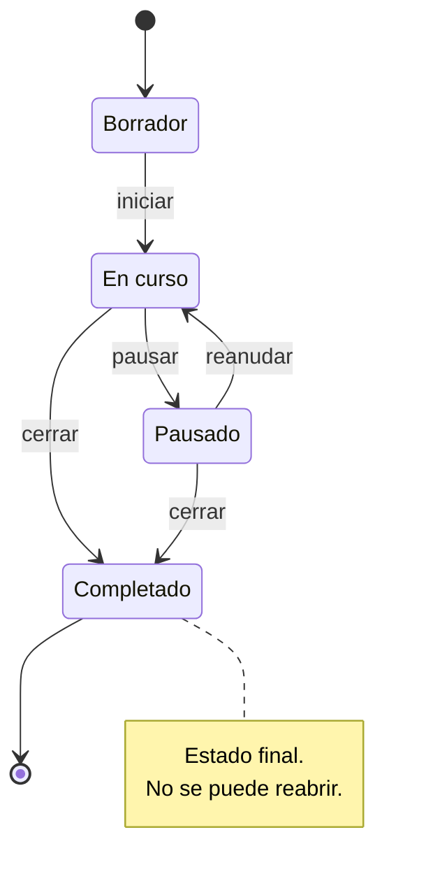
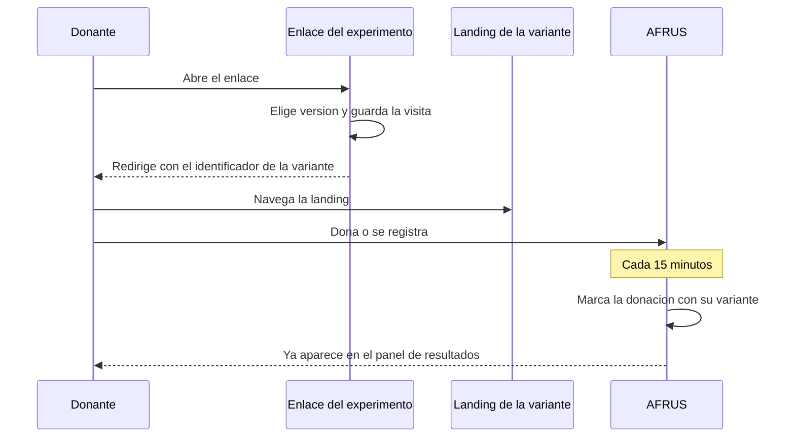

# Experimentos y pruebas A/B de landings

Aprende a crear un experimento A/B entre dos o más versiones de una landing, a repartir el tráfico entre ellas y a leer las estadísticas del panel de resultados.

**Categoría:** Landings · **Audiencia:** comunicaciones, marketing y fundraising · **Última actualización:** 2026-08-31

---

**Experimentos de landings** es la funcionalidad que te permite comparar dos o más versiones de una misma landing para descubrir cuál convierte mejor. Creas una copia de tu landing, cambias lo que quieras probar, y AFRUS reparte automáticamente a tus visitantes entre las versiones. Cuando hay datos suficientes, el panel te dice **si la diferencia es real o es casualidad**.

## Así funciona el reparto



Cada visitante ve siempre la misma versión durante 30 días, y sus donaciones o registros se atribuyen a la versión que le tocó.

### Qué pasa en cada visita



Las dos consecuencias prácticas de este diseño:

- **Las visitas repetidas no inflan los números.** Si alguien vuelve cinco veces, sigue contando como un visitante.
- **Solo el tráfico que pasa por tu enlace entra al experimento.** Quien llegue directo a la URL de una landing queda fuera de la medición.

---

## Antes de empezar

Necesitas tres cosas:

- **El módulo habilitado.** Experimentos de landings está en beta y se activa organización por organización. Si no ves la opción en el menú, escríbele al equipo de AFRUS.
- **Una landing ya creada y activa.** El experimento no parte de cero: toma una landing existente como referencia. En el selector solo aparecen las landings activas.
- **Un widget con objetivo definido en esa landing.** El objetivo del widget es lo que determina si el panel mide donaciones o leads.

---

## Paso a paso

### Parte 1 — Crear el experimento

#### 1. Entra al módulo de Experimentos

Abre **console.afrus.app** e inicia sesión. Ve a **Landings** y haz clic en el botón **Experimentos**, arriba a la derecha.

```
Landings  ->  Experimentos
```

También puedes llegar desde el menú de navegación, en el grupo **Fundraising** → **Experimentos de landings**.

#### 2. Crea un experimento nuevo

Haz clic en **Nuevo experimento**. Verás un formulario dividido en tres bloques.

#### 3. Elige la landing de control

En el bloque **1. Landing base (control)**, abre el selector **Landing** y elige la landing que quieres poner a prueba. Debajo aparecerá su URL para que confirmes que es la correcta.

Esta landing pasa a ser tu **control**: la referencia contra la que se comparan todas las demás versiones.

Deja el campo **Peso (%)** en **50** por ahora. Es el porcentaje de tráfico que recibirá el control.

> **Nota:** solo aparecen landings activas. Si no encuentras la tuya, revisa su estado en el módulo de Landings.

#### 4. Agrega tu primera variante

En el bloque **2. Variantes**, haz clic en **Agregar variante**. Aparecerá un aviso:

> *"Vas a crear una copia de tu landing de control. Esta variante nace como una copia exacta de la landing de control. Abrí el editor y modificá únicamente los elementos que quieras testear — mantener el resto igual es lo que hace válida la comparación."*

Confirma. AFRUS crea una copia idéntica de tu landing de control y la agrega como **Variante A**.

> **Importante:** cambia una sola cosa por experimento. Si modificas el titular, la imagen y el botón a la vez y la variante gana, no sabrás cuál de los tres cambios funcionó.

#### 5. Edita el contenido de la variante

En la fila de la variante, haz clic en **Editar esta landing**. Se abre el editor de landings en una pestaña nueva.

Aplica ahí el cambio que quieres probar y **guarda**. Después puedes usar **Ver esta landing** para revisarla tal como la verá el donante.

> **Importante:** abre y guarda cada variante en el editor antes de compartir el enlace. La copia se crea al instante, pero su contenido se publica cuando la guardas. Como el experimento nace ya **En curso**, si repartes tráfico antes de ese paso, parte de tus visitantes puede llegar a una página sin publicar.

#### 6. Ajusta los pesos

El **peso** es el porcentaje de tráfico que recibe cada versión. Entre todas deben sumar exactamente **100**.

Haz clic en **Distribuir equitativamente** y AFRUS reparte el 100 entre todas las versiones, control incluido. Un indicador te muestra en verde **"Suma: 100 / 100"** cuando el reparto es válido.

Para una prueba estándar, déjalo en 50/50: es el reparto que llega más rápido a un resultado concluyente.

#### 7. Ponle nombre al experimento

En el bloque **3. Datos del experimento**:

- **Nombre** (obligatorio) — cómo lo vas a identificar en la lista. Por ejemplo: "Titular urgencia vs. gratitud".
- **Descripción** (opcional) — para tu equipo; el donante nunca la ve.
- **UTMs por defecto** (opcional) — hasta seis parámetros (`utm_source`, `utm_medium`, `utm_campaign`, `utm_term`, `utm_content`, `utm_id`) que se agregarán a la URL de destino en cada visita, para que el tráfico llegue etiquetado a tu herramienta de analytics.

No hay campo de identificador: AFRUS lo genera solo a partir del nombre.

#### 8. Crea el experimento

Haz clic en **Crear experimento**. El botón solo se activa cuando el formulario está completo: landing de control elegida, al menos una variante, todos los pesos enteros y sumando 100, y nombre cargado.

> **Listo.** El experimento queda creado y **En curso** desde ese momento. Verás una pantalla de confirmación con tus versiones, el **enlace del experimento** y un **código QR** listo para usar.

---

### Parte 2 — Compartir el enlace

Todo el experimento se distribuye con **un solo enlace**: la URL del splitter. Ese es el enlace que va en tus anuncios, newsletters, publicaciones y piezas impresas.

> **Importante:** nunca compartas la URL de una variante individual. Una visita que entra directo a una landing no pasa por el reparto, no se mide y su donación no se atribuye a ninguna versión.

Puedes copiar el enlace desde tres lugares:

| Dónde | Cómo |
|---|---|
| Pantalla de confirmación | Botón de copiar junto al enlace, con código QR incluido |
| Lista de experimentos | Acción **Copiar enlace del splitter** en la fila |
| Pantalla de edición | Campo **URL del splitter** con botón de copiar |

Si agregas parámetros propios al enlace que compartes, se propagan a la landing de destino y **tienen prioridad** sobre las UTMs por defecto del experimento. Así puedes usar el mismo experimento en varias campañas con etiquetado distinto.

---

### Parte 3 — Leer los resultados

Entra a **Ver resultados** desde la fila del experimento. El botón **Actualizar** recarga los números sin salir de la pantalla.

Mientras no llegue tráfico verás el mensaje *"Todavía no hay tráfico en este experimento"*.

#### Los seis indicadores generales

| Indicador | Qué mide |
|---|---|
| **Visitas totales** | Todas las visitas que recibió el enlace, incluyendo bots |
| **Bots filtrados** | Visitas identificadas como tráfico automatizado |
| **Tasa de bots** | Qué porcentaje del total fue bot |
| **Visitas reales** | Visitas humanas, después de descartar bots. **Es la base de todo el análisis** |
| **IPs únicas** | Direcciones distintas que llegaron al enlace |
| **Visitantes únicos** | Personas distintas identificadas por cookie |

#### La tabla por variante

| Columna | Qué te dice |
|---|---|
| **Variante** | La etiqueta y su landing. La fila del control aparece marcada |
| **Visitas reales** | Cuántas personas vieron esa versión |
| **Donaciones confirmadas** / **Leads confirmados** | Cuántas convirtieron. El título cambia según el objetivo de tu widget |
| **Tasa de conversión** | Qué porcentaje de los visitantes convirtió |
| **Lift vs control** | Cuánto mejor o peor convierte respecto del control. Verde si es positivo, rojo si es negativo |
| **Significancia** | Si la diferencia es sólida o puede ser casualidad |
| **Funnel** | El recorrido paso a paso: **Visitas reales** → **Conversión** |

El gráfico **Tasa de conversión por variante** muestra lo mismo en barras, con el control en gris.

#### La etiqueta de significancia

Es la que responde la pregunta que importa: *¿esta diferencia es real?*

| Etiqueta | Qué significa | Qué hacer |
|---|---|---|
| **Datos insuficientes** | Todavía no hay volumen para concluir nada | Sigue recolectando. Ignora las diferencias que veas por ahora |
| **Aún no significativa** | Hay volumen, pero la diferencia puede deberse al azar | Sigue recolectando, o acepta que rinden parecido |
| **Diferencia significativa** | La diferencia difícilmente sea casualidad | Ya puedes decidir |

La etiqueta incluye el nivel de confianza, por ejemplo *"Diferencia significativa — 97,3% confianza"*. En la tarjeta de ganadora, **Ver detalles** te muestra el Z-score y el P-value.

> **Nota:** una diferencia significativa no siempre es importante. Con mucho tráfico, una mejora del 0,3% puede ser significativa y aun así irrelevante. Mira siempre las dos cosas: el **lift** dice cuánto cambia, la **significancia** dice si puedes confiar en ese cambio.

---

### Parte 4 — Declarar la ganadora y cerrar

#### 1. Revisa la sugerencia automática

La tarjeta superior del panel sugiere la variante con mejor tasa de conversión **entre las que alcanzaron significancia estadística**. Si ninguna la alcanzó, no sugiere ninguna.

#### 2. Declara la ganadora

Haz clic en **Cambiar ganadora** y elige la versión. Aparecerá una marca **Manual**. Con **Volver a automático** deshaces la elección.

> **Importante:** declarar una ganadora deja registrada tu decisión, pero **no cambia el reparto de tráfico ni el estado del experimento**. Para que todos vean la versión ganadora tienes que subir su peso o publicar su contenido en tu landing principal.

#### 3. Cierra el experimento

Ve a **Editar**, cambia el selector **Estado** a **Completado** y haz clic en **Guardar cambios**.

> **Listo.** El experimento queda en solo lectura y todo el tráfico del enlace vuelve a la landing de control. Los enlaces que ya compartiste **siguen funcionando**.

> **Nota:** Completado es definitivo, no se puede reabrir. Si solo quieres detener la prueba un tiempo, usa **Pausado**.

---

## Especificación de las variantes

### Qué define a una variante

| Atributo | Reglas |
|---|---|
| **Etiqueta** | Texto libre. El control se llama siempre `Control` |
| **Landing** | Se crea como copia del control. **No se puede reasignar**: para apuntar a otra landing hay que quitar la variante y crear una nueva. Dos variantes no pueden usar la misma landing |
| **Peso** | Número entero entre **1 y 99**. La suma de todos debe ser exactamente **100** |
| **Identificador** | Código de 12 caracteres que viaja en la URL y permite atribuir las conversiones. Se genera solo |
| **Control** | Exactamente uno por experimento. No se puede quitar |

El tope de 99 es deliberado: impide que una sola versión se quede con todo el tráfico y deje al experimento sin nada que comparar.

No puedes quedarte con menos de control + una variante.

> **Nota:** si quitas una variante que ya tuvo tráfico, **su landing se conserva**. El panel te avisa que puedes gestionarla o borrarla desde Landings. Es intencional: borrarla rompería el histórico.

### Qué se puede editar en cada estado

| Elemento | Borrador | En curso | Pausado | Completado |
|---|---|---|---|---|
| Nombre y descripción | Sí | Sí | Sí | No |
| Identificador del experimento | Sí | No | No | No |
| UTMs por defecto | Sí | Sí | Sí | No |
| Etiqueta y peso de las variantes | Sí | Sí | Sí | No |
| Agregar o quitar variantes | Sí | Sí | Sí | No |
| Declarar ganadora | Sí | Sí | Sí | **Sí** |

La landing de una variante no aparece en la tabla porque **no se reasigna en ningún estado**: para apuntar a otra página hay que quitar la variante y crear una nueva.

Un experimento completado muestra el aviso *"Este experimento está completado y no se puede editar."* y bloquea todos los campos. La única excepción es declarar ganadora.

---

## Estados del experimento

| Estado | Qué hace con el tráfico |
|---|---|
| **Borrador** | Envía todo al control, sin medir |
| **En curso** | Reparte según los pesos, mide y atribuye conversiones |
| **Pausado** | Envía todo al control, sin medir. Los datos ya recolectados se conservan |
| **Completado** | Envía todo al control, sin medir. El experimento queda en solo lectura |

Transiciones posibles:



No hay botones de iniciar o pausar: el cambio se hace desde el selector **Estado** en la pantalla de edición y se aplica al **Guardar cambios**.

> **Nota:** tus enlaces nunca se rompen al pausar o completar. Siempre llevan a la landing de control. Es importante si el enlace ya está impreso o en un anuncio activo.

---

## Cómo se calculan las estadísticas

Esta sección es la referencia técnica. Todas las métricas salen de datos propios de AFRUS (las visitas al enlace y las conversiones atribuidas), no de Google Analytics ni de Meta.

### La unidad base: la exposición

Cada vez que el enlace asigna un visitante **nuevo** a una versión, AFRUS guarda una exposición: qué experimento, qué variante, un identificador de visitante, un hash de la IP, si fue bot y la fecha.

Dos precisiones que explican casi todas las dudas sobre los números:

- **Las visitas repetidas no generan exposición.** Si alguien vuelve cinco veces, cuenta como un visitante.
- **La IP se guarda cifrada**, nunca en claro. Por eso la métrica se llama "IPs únicas" y no identifica personas. Como efecto secundario, varias personas en la misma red corporativa o en el mismo operador móvil pueden contarse como una sola IP.

### Definición exacta de cada métrica

| Métrica | Definición |
|---|---|
| Visitas totales | Cantidad de exposiciones, bots incluidos |
| Bots filtrados | Exposiciones marcadas como bot |
| Visitas reales | Exposiciones **no** marcadas como bot |
| Tasa de bots | `Bots filtrados / Visitas totales` |
| IPs únicas | Hashes de IP distintos, bots incluidos |
| Visitantes únicos | Identificadores de visitante distintos, bots incluidos |
| Visitantes únicos reales | Identificadores distintos entre las visitas no-bot. **Es el denominador de la tasa de conversión** |

Los seis indicadores generales del panel son la **suma** de estos valores entre todas las variantes.

### Tasa de conversión y lift

```
Tasa de conversion = Conversiones / Visitantes unicos reales

Lift vs control = (Tasa de la variante - Tasa del control) / Tasa del control
```

El lift no se calcula para el control (es su propia referencia) ni cuando el control tiene tasa cero.

### El funnel

En esta versión tiene **dos pasos**: **Visitas reales** → **Conversión**. El paso intermedio de vista del widget está previsto para más adelante y todavía no se registra.

### Significancia estadística

Se usa un **test z de dos proporciones agrupadas**, comparando cada variante contra el control:

```
p1 = conversiones de la variante / visitantes unicos reales de la variante
p2 = conversiones del control    / visitantes unicos reales del control

p_agrupada = (conversiones variante + conversiones control)
             / (visitantes variante + visitantes control)

error_estandar = raiz( p_agrupada * (1 - p_agrupada) * (1/n_variante + 1/n_control) )

z = (p1 - p2) / error_estandar
```

- **Nivel de confianza: 95%**, prueba de dos colas. El umbral es `|z| >= 1,96`.
- El **P-value** sale de la distribución normal a dos colas, y la confianza que muestra el panel es `(1 - P-value) × 100`.

**Umbrales mínimos de muestra.** Antes de calcular nada, AFRUS exige que **tanto la variante como el control** tengan:

- al menos **100 visitantes únicos reales**, y
- al menos **30 conversiones**.

Si cualquiera de los dos lados no llega, el veredicto es **Datos insuficientes** y no se muestra Z-score ni P-value.

Este bloqueo es deliberado: es la defensa contra el error más común del A/B testing, que es mirar los resultados el primer día, ver una versión "ganando" por puro ruido, y cortar el experimento antes de tiempo.

El control nunca tiene etiqueta de significancia propia: es la referencia.

### Qué cuenta como conversión

AFRUS resuelve el objetivo mirando el **widget de la landing de control**:

| Objetivo del widget | Qué cuenta | Título de la columna |
|---|---|---|
| Donación | Donaciones atribuidas | "Donaciones confirmadas" |
| Registro | Registros atribuidos | "Leads confirmados" |
| No se pudo determinar | Donaciones + registros | "Conversiones" |

> **Nota:** si ves el título genérico **"Conversiones"**, es señal de que AFRUS no pudo resolver el objetivo del widget, normalmente porque la landing de control no tiene widget o formulario asociado. Revisa su configuración.

### Cómo se atribuye una conversión



1. El enlace agrega a la URL de destino un parámetro con el identificador de la variante servida.
2. Cuando el visitante dona o se registra, ese identificador viaja con la operación.
3. AFRUS marca esa donación o registro con la variante correspondiente.

Para donaciones, la atribución corre en un **proceso que se ejecuta cada 15 minutos**. Por eso las conversiones aparecen con retraso frente a las visitas: si haces una donación de prueba y miras el panel enseguida, es normal que la visita ya esté y la conversión todavía no.

### Filtrado de bots

AFRUS clasifica cada visita antes de contarla. Se marca como bot cuando:

- La visita **no declara navegador**.
- El navegador declarado corresponde a un **rastreador o herramienta automatizada conocida**: buscadores, previsualizadores de enlaces de redes sociales y mensajería, navegadores automatizados y clientes de línea de comandos.
- La **misma IP supera un umbral de visitas por minuto** sobre el mismo experimento. El umbral lo configura AFRUS.

Qué pasa con una visita marcada como bot:

- **Se redirige igual**, siempre al control. Así, cuando alguien comparte tu enlace en WhatsApp o Facebook, la miniatura se genera siempre a partir de la misma página.
- **Nunca puede producir una conversión atribuida.**
- Se cuenta en Visitas totales, Bots filtrados, IPs únicas y Visitantes únicos, pero **queda fuera de Visitas reales**, de la tasa de conversión, del funnel y del cálculo de significancia.

Por eso el panel separa "Visitas totales" de "Visitas reales": la primera es el volumen bruto, la segunda es la base sobre la que se decide.

### La cookie de asignación

- **Dura 30 días.**
- Guarda a qué versión fue asignado el visitante, para mostrarle siempre la misma.
- No es accesible desde JavaScript y se limita al dominio del experimento.
- Si el visitante borra sus cookies, cambia de navegador o entra desde otro dispositivo, se le trata como visitante nuevo y puede tocarle otra versión.

---

## Buenas prácticas

- **Cambia una sola variable por experimento.** Si quieres probar titular e imagen, haz dos experimentos.
- **Define de antemano cuánto vas a esperar.** Fija el volumen o la fecha antes de arrancar y no mires el resultado para decidir cuándo cortar.
- **Deja correr al menos una semana completa.** El comportamiento de donación cambia mucho entre días de semana, fines de semana y horarios.
- **No cambies los pesos a mitad de camino** si puedes evitarlo: los resultados son acumulados y estarías mezclando dos períodos distintos.
- **No corras dos experimentos sobre la misma landing a la vez.** Se pisan entre sí y ninguno es confiable.
- **Comparte siempre el enlace del experimento**, nunca la URL de una variante.
- **Revisa la tasa de bots** antes de confiar en los números.
- **Abre y guarda cada variante en el editor** antes de repartir tráfico.

---

## Limitaciones conocidas

| Limitación | Impacto |
|---|---|
| Los resultados no se filtran por fecha | Los números son siempre acumulados desde el inicio. Para analizar un período hay que llevar registro manual |
| No hay métrica de monto recaudado | Se cuentan conversiones, no montos. Una versión con más donaciones pero de menor monto se ve como ganadora. Cruza con el módulo de Transacciones antes de decidir |
| El conteo de donaciones no filtra por estado de la pasarela | Toda donación atribuida suma, esté acreditada o no. Relevante si usas métodos asíncronos como PIX, boleto o transferencia |
| El funnel tiene solo dos pasos | No hay paso intermedio de vista de widget ni de inicio de checkout |
| No hay desglose de las IPs únicas | El indicador muestra el total, sin detalle |
| El enlace puede usar el dominio técnico de AFRUS | En organizaciones sin dominio propio configurado. Funciona igual, pero es menos presentable. Consulta con AFRUS si necesitas un dominio propio |
| La landing de una variante no se puede reasignar | Hay que quitar la variante y crear otra |
| La ganadora no se aplica sola | Declararla registra tu decisión; redirigir el tráfico requiere ajustar pesos o publicar el contenido ganador |

---

## Preguntas frecuentes

### 1. ¿Cuánto tiempo tengo que dejar corriendo un experimento?

Hasta que el panel muestre **Diferencia significativa**, y como mínimo una semana completa. El requisito duro son los umbrales de muestra: **100 visitantes únicos reales y 30 conversiones en cada versión**, control incluido.

Una cuenta rápida: si tu landing convierte al 3%, necesitas unos 1.000 visitantes por versión para llegar a 30 conversiones. Con reparto 50/50, son unos 2.000 visitantes en total.

### 2. ¿Un visitante ve siempre la misma versión?

Sí, durante 30 días, mientras conserve la cookie. Si borra cookies, cambia de navegador o entra desde otro dispositivo, se le trata como visitante nuevo y puede tocarle otra versión.

### 3. ¿Por qué "Visitas totales" y "Visitas reales" no coinciden?

La diferencia son los bots: rastreadores, previsualizadores de enlaces y tráfico automatizado. "Visitas reales" es lo que queda después de descartarlos, y es la base de todas las decisiones.

### 4. Hice una donación de prueba y no aparece. ¿Está roto?

Probablemente no. La atribución de donaciones corre **cada 15 minutos**: espera ese lapso y actualiza. Si sigue sin aparecer, revisa que hayas entrado por el **enlace del experimento** y no directo a la landing.

### 5. ¿Puedo agregar una variante con el experimento ya corriendo?

Sí, sin pausarlo. Ten en cuenta dos cosas: los pesos tienen que volver a sumar 100, y la variante nueva arranca desde cero, así que tardará más en acumular muestra suficiente.

### 6. ¿Qué pasa con los enlaces que ya compartí si pauso o completo el experimento?

Siguen funcionando y llevan a la landing de control. Nunca vas a dejar un enlace roto por cambiar el estado.

### 7. La tasa de bots es altísima. ¿Qué hago?

Primero revisa dónde publicaste el enlace: si circuló por WhatsApp, Slack, Facebook o Twitter, los previsualizadores de esas plataformas generan visitas automatizadas. Es esperable y no contamina los resultados, porque quedan fuera de las métricas de decisión. Si es alto sin una explicación así, avisa a AFRUS.

### 8. ¿Por qué la columna dice "Conversiones" y no "Donaciones confirmadas"?

Porque AFRUS no pudo determinar el objetivo del widget de tu landing de control, normalmente porque no tiene widget o formulario asociado. En ese caso el número suma donaciones y registros. Revisa la configuración de la landing.

### 9. Una versión tiene mejor tasa pero dice "Aún no significativa". ¿Puedo darla por ganadora?

Puedes declararla manualmente, pero no es recomendable. "Aún no significativa" significa que la diferencia que ves entra dentro de lo que produciría el azar. Si decides ahora, hay riesgo real de cambiar tu landing por una que no es mejor.

### 10. ¿La ganadora se aplica sola a toda mi audiencia?

No. Declararla registra tu decisión, pero no cambia el reparto ni el estado. Para que todo el tráfico vea la versión ganadora tienes que subir su peso, o completar el experimento y llevar su contenido a tu landing principal.

### 11. ¿Puedo ver los resultados de un mes en particular?

No en esta versión. Los resultados son siempre acumulados desde el inicio. Si necesitas comparar períodos, anota los valores al cierre de cada uno.

### 12. ¿Se comparan los montos donados entre versiones?

No. El panel cuenta conversiones, no montos. Es una limitación importante: una versión puede ganar en cantidad de donaciones y recaudar menos. Antes de decidir, cruza el resultado con el módulo de Transacciones.

### 13. ¿Qué pasa si alguien entra directo a la URL de una variante?

Ve la página normalmente, pero queda **fuera del experimento**: no genera visita medida y su donación no se atribuye a ninguna versión. Por eso siempre se difunde el enlace del experimento.

### 14. ¿Esto afecta mi tracking de analytics?

No. El enlace responde con una redirección estándar, el mecanismo habitual para este tipo de pruebas. Las UTMs que definas se propagan a la landing de destino, y las que agregues al enlace compartido tienen prioridad. La configuración de analytics de cada landing sigue funcionando de forma independiente en cada versión.

### 15. ¿Puedo probar dos cambios a la vez?

Puedes crear tres versiones (control, "titular nuevo" e "imagen nueva") y es un experimento válido. Lo que no debes hacer es meter los dos cambios en **una misma** variante, porque si gana no sabrás cuál funcionó. Ten en cuenta que cada versión adicional necesita su propia muestra de 100 visitantes y 30 conversiones, así que el experimento tarda más.

---

## Glosario

| Término | Significado |
|---|---|
| **Control** | La versión original, la referencia de comparación |
| **Variante** | Una versión alternativa a probar |
| **Peso** | Porcentaje de tráfico asignado a una versión |
| **Splitter** | El servicio que reparte el tráfico entre las versiones |
| **Exposición** | Registro de un visitante nuevo asignado a una versión |
| **Lift** | Diferencia relativa de tasa de conversión contra el control |
| **Significancia** | Probabilidad de que la diferencia observada no sea azar |
| **P-value** | Probabilidad de ver esta diferencia si en realidad no hubiera ninguna. Cuanto más bajo, más sólido el resultado |
| **Z-score** | Cuántos errores estándar separan las dos tasas. Desde 1,96 se considera significativo al 95% |

---

*¿Dudas sobre este tutorial o sobre la configuración de un experimento? Contacta al equipo de Customer Success de AFRUS.*
