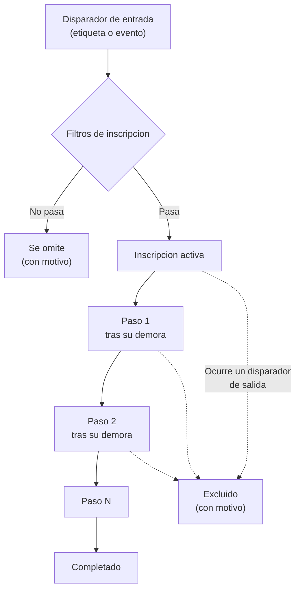
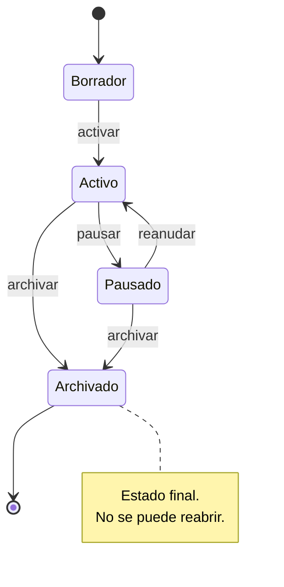
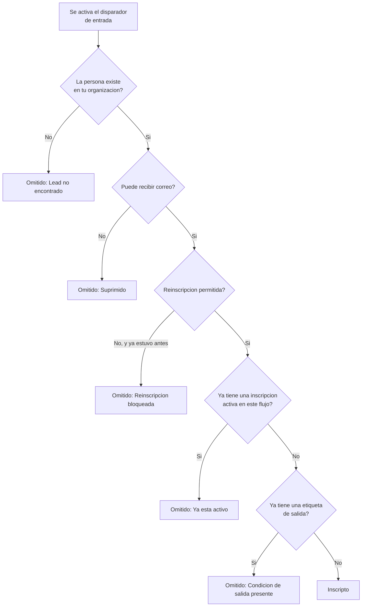
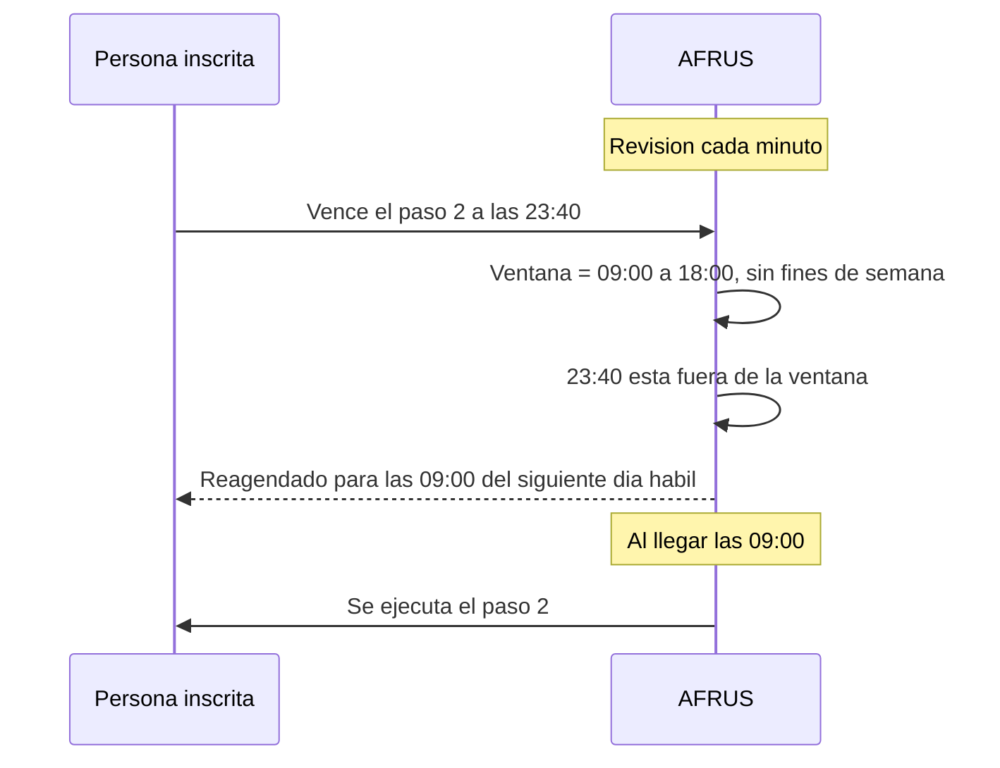

# Guía completa de Flujos de trabajo (Workflows)

Cómo construir una secuencia automatizada en AFRUS: quién entra, qué pasa con cada persona, cuándo se envía cada correo y cómo leer el reporte.

*Módulo: Flujos de trabajo · Menú: Procesos > Flujos de trabajo · Audiencia: comunicaciones, marketing, fundraising y Customer Success*

---

## Qué es un flujo de trabajo

**Un flujo de trabajo es una secuencia de acciones que se ejecuta sola, una persona a la vez.** Defines una condición de entrada (por ejemplo, "cuando a alguien se le agrega la etiqueta *Donante nuevo*"), armas una lista ordenada de pasos con una demora entre cada uno, y a partir de ahí AFRUS se encarga: cada persona que cumpla la condición entra al flujo, avanza paso por paso a su propio ritmo y sale cuando termina la secuencia o cuando ocurre algo que la saca antes.

La diferencia con un envío masivo es que aquí **el reloj empieza a correr para cada persona en el momento en que entra**, no en una fecha fija. Si alguien entra hoy a las 3 de la tarde y el segundo paso tiene una demora de dos días, ese correo se le enviará pasado mañana a las 3 de la tarde, sin importar cuándo entraron los demás.

Los pasos no son solo correos. Un flujo también puede agregar o quitar etiquetas, sumar o restar puntos de scoring, e incluso iniciar otro flujo.

## Así funciona



Antes de cada paso AFRUS vuelve a revisar la situación de esa persona. Si mientras tanto se dio de baja, si le pusieron una etiqueta que es condición de salida, o si el flujo se pausó, el paso no se ejecuta. Esa revisión no ocurre solo al entrar: ocurre **cada vez** que le toca avanzar.

## Antes de empezar

- **Tu dominio de envío de correo tiene que estar verificado.** Si no lo está, el botón "Nuevo workflow" aparece deshabilitado con el mensaje *"Verifica el dominio de envío de correo antes de crear un workflow"*. La verificación se hace en el módulo de Autoresponders y en la parte superior de la pantalla de flujos verás una tarjeta con el estado actual.
- **Ten claras las etiquetas que vas a usar.** Los disparadores por etiqueta y los pasos de etiqueta trabajan sobre etiquetas que ya existen en tu organización.
- **Decide antes cuál es la meta.** Es mucho más fácil armar la secuencia sabiendo qué acción cuenta como éxito.

---

# Paso a paso

## Parte 1 — Crea el flujo

1. **Entra al módulo.** En el menú lateral: **Procesos > Flujos de trabajo**.

2. **Pulsa "Nuevo workflow".** Se abre el diálogo *Nuevo flujo de trabajo* con dos campos: **Nombre** (obligatorio) y **Descripción** (opcional). El nombre es lo que verás en la lista y en el reporte, así que ponle algo que distinga bien: "Bienvenida donante nuevo 2026" es mejor que "Bienvenida".

3. **Pulsa "Crear".** AFRUS crea el flujo en estado **Borrador** y te lleva directo al constructor. Mientras esté en borrador no le pasa nada a nadie: puedes armarlo con calma, guardar y volver otro día.

## Parte 2 — Define quién entra

El constructor muestra un lienzo con tres bloques conectados en vertical: **Inscripción** arriba, tus pasos en el medio, y **Salida / Meta** abajo. Al hacer clic en cualquiera de ellos, el panel derecho cambia para configurarlo.

4. **Haz clic en el bloque "Inscripción".** El panel derecho muestra *Disparadores de entrada*.

5. **Elige el tipo de disparador.** Hay dos:

   | Tipo | Cuándo dispara | Qué configuras |
   |---|---|---|
   | **Etiqueta agregada** | En el momento en que a una persona se le agrega esa etiqueta | La etiqueta |
   | **Evento** | Cuando ocurre un evento de la plataforma para esa persona | El tipo de evento y, opcionalmente, la campaña |

   Los tipos de evento disponibles son: `donation`, `subscription`, `recurrent_charge`, `failed_donation`, `failed_subscription`, `cancelled_subscription`, `donation_pending`, `lead`, `registration` y `abandoned_lead`.

6. **Si eliges Evento, considera filtrar por campaña.** El campo *Campaña* es opcional y funciona como un filtro: si seleccionas una, el disparador se activa solo cuando el evento ocurre dentro de esa campaña. Si lo dejas vacío, cualquier ocurrencia del evento activa el disparador, sin importar la campaña.

7. **Pulsa "Agregar disparador".** El botón permanece deshabilitado hasta que el campo obligatorio (la etiqueta, o el tipo de evento) tenga valor. Puedes agregar varios disparadores de entrada: se comportan como un **O** — basta con que se cumpla uno para que la persona entre.

## Parte 3 — Arma los pasos

8. **Agrega el primer paso.** Usa el botón **"Agregar paso"** arriba a la derecha del lienzo, o el pequeño botón "+" que aparece sobre cualquier conexión entre dos bloques si quieres insertarlo en medio. Al agregarlo eliges el tipo de acción.

   Hay seis tipos de paso:

   | Paso | Qué hace | Qué necesita para poder activarse |
   |---|---|---|
   | **Enviar correo** | Envía un correo a la persona | Asunto y un remitente verificado |
   | **Agregar etiqueta** | Le pone una etiqueta a la persona | Una etiqueta |
   | **Eliminar etiqueta** | Le quita una etiqueta | Una etiqueta |
   | **Agregar puntos** | Suma puntos al scoring | Un número entero mayor que cero |
   | **Restar puntos** | Resta puntos al scoring | Un número entero mayor que cero |
   | **Iniciar otro flujo** | Inscribe a la persona en otro flujo | Un flujo destino, activo y distinto de este |

   Un paso al que le falta su configuración obligatoria muestra la marca **"Incompleto — falta:"** en el lienzo y bloquea la activación hasta que lo completes.

9. **Ajusta la demora del paso.** Con el paso seleccionado, el panel derecho muestra **Demora** y **Unidad** (minutos, horas, días o semanas). La demora es **el tiempo que se espera antes de ejecutar ese paso**, contado desde el momento anterior: para el primer paso, desde que la persona se inscribió; para los siguientes, desde que se ejecutó el paso previo.

   Una demora de **0** significa "en cuanto sea posible". En la práctica hay un retardo de hasta un minuto, porque AFRUS revisa los vencimientos una vez por minuto.

10. **Configura el contenido del paso.** Depende del tipo:

    **Enviar correo.** El panel pide *Asunto*, *Nombre del remitente*, *Email del remitente* y *Responder a* (opcional). El email del remitente se elige de una lista de direcciones autorizadas de tu organización. Junto al asunto tienes el botón de **etiquetas de fusión** para insertar campos personalizados como el nombre de la persona, y se insertan justo donde tengas el cursor.

    Para el cuerpo del correo, pulsa **"Editar correo"**. Se abre un editor a pantalla completa con cuatro pestañas:

    - **Diseño actual** — vista previa de lo que ya tiene el paso (solo aparece si ya hay un diseño hecho con el editor visual).
    - **Galería** — plantillas prediseñadas.
    - **Correos enviados** — reutiliza un correo que ya enviaste desde Comunicaciones.
    - **Editor HTML** — pega tu propio HTML.

    También puedes **"Empezar en blanco"**. Si el paso ya tenía un diseño, AFRUS te pide confirmación antes de reemplazarlo, porque el diseño anterior se pierde. Una vez guardado el contenido, el botón **"Vista previa"** se habilita.

    **Agregar / Eliminar etiqueta.** Un único campo: la etiqueta. El buscador consulta el catálogo de tu organización mientras escribes.

    **Agregar / Restar puntos.** Un único campo numérico. Tiene que ser un entero mayor que cero: el 0 y los negativos no se guardan.

    **Iniciar otro flujo.** Un selector con los flujos que puedes encadenar. Solo se ofrecen flujos **activos**, y nunca el flujo actual. Si el flujo que habías elegido después se pausó, se sigue mostrando pero marcado, con el aviso *"Este flujo no está activo. El paso se omitirá hasta que se active"*. Si lo borraron, verás *"El flujo seleccionado ya no existe"*.

11. **Ordena los pasos.** Arrastra los bloques en el lienzo para cambiar el orden. Al soltar, el nuevo orden se guarda solo. La conexión que entra a cada bloque muestra su demora ("esperar 2 días"), así que puedes leer la línea de tiempo completa de un vistazo.

## Parte 4 — Define cómo se sale y cuál es la meta

12. **Haz clic en el bloque "Salida / Meta".** El panel derecho muestra *Disparadores de salida*, con la misma mecánica que los de entrada: por etiqueta agregada o por evento.

    Un disparador de salida saca del flujo a quien lo cumpla, aunque le queden pasos pendientes. Es la forma de decir "si ya donó, deja de pedirle que done".

13. **Marca cuál de ellos es la meta.** Junto a cada disparador de salida hay un selector redondo. El que marques es la **meta** del flujo: las salidas por ese disparador son las que cuentan como éxito y alimentan la **Tasa de meta** del reporte. Solo puede haber una meta.

    Ten en cuenta que **la baja y la supresión siempre sacan a la persona**, esté configurado o no. Es una regla del sistema, no una opción.

## Parte 5 — Revisa la configuración

14. **Abre "Configuración"** desde la barra superior del constructor. Aquí viven tres opciones que cambian mucho el comportamiento del flujo.

    **Permitir reinscripción.** Si está desactivada, una persona que ya se inscribió alguna vez no puede volver a entrar aunque el disparador se active de nuevo. Actívala si quieres que la misma persona pueda pasar por el flujo varias veces. Incluso con la reinscripción activada, **nunca hay dos inscripciones activas a la vez** para la misma persona en el mismo flujo: tiene que terminar la anterior.

    **Inscribir leads que ya coinciden con el disparador de entrada** — la inscripción retroactiva. Tiene su propia sección más abajo, porque es la opción que más sorpresas causa.

    **Ventana de envío.** Define las horas, la zona horaria y los días en los que este flujo puede enviar. También tiene su sección propia.

## Parte 6 — Activa

15. **Pulsa "Activar".** Se abre una confirmación que te recuerda que, una vez activo, las personas que coincidan con el disparador de entrada empezarán a inscribirse. El diálogo incluye el interruptor de inscripción retroactiva, para que decidas en ese momento.

16. **Si algo falta, AFRUS te lo dice antes.** La activación se rechaza y muestra la lista exacta de lo que hay que corregir. Los motivos posibles son:

    | Problema | Qué significa |
    |---|---|
    | Sin disparador de entrada | El flujo no tiene forma de que entre nadie |
    | Sin pasos | El flujo no hace nada |
    | Paso de correo incompleto | Falta el asunto, o el remitente no está verificado |
    | Paso de etiqueta sin etiqueta | Falta elegir la etiqueta |
    | Paso de puntos sin cantidad | Falta el número, o no es un entero mayor que cero |
    | Paso de flujo sin destino | Falta elegir el flujo a iniciar |

17. **Listo.** Al activarse verás el mensaje *"Tu secuencia se creó y activó correctamente. Ya está inscribiendo leads, y cualquier cambio que hagas desde ahora se aplica de inmediato"*, con un acceso directo al reporte.

---

## Estados del flujo



| Estado | Qué pasa con las inscripciones |
|---|---|
| **Borrador** | Nadie entra. Es el estado de edición. |
| **Activo** | Entra gente nueva y las inscripciones existentes avanzan. |
| **Pausado** | No avanza ningún paso. Las inscripciones activas quedan congeladas donde estaban y retoman al reanudar. |
| **Archivado** | Estado final. Las inscripciones activas se cierran con motivo *Archivado*. No se puede volver atrás. |

Un flujo en borrador no tiene reporte: si intentas abrirlo, AFRUS te lleva al constructor.

---

## Quién entra y quién no

Que el disparador se active no garantiza que la persona entre. Antes de inscribir a alguien, AFRUS aplica una serie de filtros en orden. El primero que no se cumpla detiene la inscripción, y el motivo queda registrado.



| Motivo | Qué ocurrió |
|---|---|
| **Inscripto** | Entró al flujo correctamente. |
| **Suprimido** | El correo de la persona no puede recibir envíos: rebote duro, baja voluntaria o dirección deshabilitada. Un rebote transitorio no suprime. |
| **Reinscripción bloqueada** | Ya pasó por este flujo antes y la reinscripción está desactivada. |
| **Ya está activo** | Tiene una inscripción en curso en este mismo flujo. |
| **Condición de salida presente** | Ya cumple una de las condiciones de salida por etiqueta, así que entraría solo para salir de inmediato. |
| **Lead no encontrado** | La persona no existe o no pertenece a tu organización. |
| **Fallido** | Error inesperado al procesar esa inscripción. |

---

## La inscripción retroactiva

Por defecto, un flujo solo alcanza a **quienes cumplan la condición a partir de la activación**. Si activas hoy un flujo con entrada por la etiqueta *Donante nuevo*, las 4.000 personas que ya tienen esa etiqueta no entran: solo entrarán quienes la reciban de ahora en adelante.

La opción **"Inscribir leads que ya coinciden con el disparador de entrada"** cambia eso: al activar el flujo, AFRUS hace además una **puesta al día** e inscribe a quienes ya coinciden hoy.

Cuatro cosas que conviene saber antes de encenderla:

**Es de una sola vez, por flujo.** La puesta al día se ejecuta una vez y no vuelve a ejecutarse. Si la activas otra vez más adelante, verás *"Ya se ejecutó una inscripción retroactiva para este workflow, así que no se inició una nueva"*.

**Puedes encenderla con el flujo ya activo.** Si el flujo lleva tiempo corriendo y activas la opción desde Configuración, la puesta al día se dispara en ese momento. Esto puede inscribir a mucha gente de golpe, así que revísalo antes de guardar.

**Tiene un tope de 10.000 personas.** Si la población que coincide supera ese número, AFRUS **rechaza la operación** en vez de inscribir a unas cuantas al azar, y te indica que actives sin retroactiva y luego inscribas por lotes. Es deliberado: enrolar 10.000 de 180.000 personas sin poder saber cuáles quedaron fuera es peor que no hacer nada.

**No cubre todos los tipos de disparador.** La puesta al día sabe resolver dos poblaciones: quienes hoy llevan la etiqueta de un disparador de entrada por etiqueta, y quienes tienen una donación que coincide con un disparador de entrada de la familia de donaciones (`donation`, `subscription`, `recurrent_charge`, `failed_donation`, `failed_subscription`, `cancelled_subscription`, `donation_pending`). Un disparador de entrada por `lead`, `registration` o `abandoned_lead` no aporta nadie a la puesta al día.

Mientras corre verás una barra de progreso en el constructor. Estos son los mensajes que puede darte al terminar y qué significa cada uno:

| Mensaje | Qué pasó | Qué hacer |
|---|---|---|
| *"Inscripción retroactiva finalizada"* | Terminó bien. | Abre el reporte para ver cuántos entraron y por qué se omitió alguno. |
| *"Terminó con problemas"* | Terminó, pero N personas no se pudieron inscribir. | Abre el reporte para ver los motivos. |
| *"No se inscribió a nadie"* | O el flujo no tiene un disparador de entrada por etiqueta, o nadie tiene esa etiqueta ahora mismo. | Revisa el disparador. |
| *"Ya se ejecutó una inscripción retroactiva"* | Es un flujo al que ya se le hizo la puesta al día. | Nada. Es lo esperado. |
| *"El workflow se activó, pero la inscripción retroactiva no se pudo encolar"* | **El flujo quedó activo y ningún lead existente fue inscrito.** Los que se etiqueten a partir de ahora sí entrarán con normalidad. | Contacta a soporte para ejecutar la puesta al día. |
| *"Está tardando más de lo esperado"* o *"perdimos contacto"* | AFRUS dejó de seguir el progreso desde esta pantalla. No sabemos desde aquí si terminó. | Abre el reporte para comprobarlo. |

---

## La ventana de envío

Sin ventana de envío, un paso se ejecuta apenas vence su demora, sea la hora que sea. Con la ventana activada defines **desde qué hora, hasta qué hora, en qué zona horaria** y si se **omiten los fines de semana**.

La regla es simple: **si un paso vence fuera de la ventana, no se cancela, se reagenda al siguiente horario permitido.**



Detalles que importan:

- **La zona horaria se toma de tu perfil de usuario** la primera vez que activas la ventana. Si tu perfil no la tiene, se usa `America/Bogota`.
- **Toda la aritmética se hace en esa zona horaria**, así que los cambios de horario de verano se manejan correctamente.
- **Se aplica también al primer paso.** Alguien que se inscriba a las 3 de la mañana no recibe el primer correo a las 3 de la mañana.
- **Se vuelve a comprobar justo antes de ejecutar cada paso**, no solo al agendarlo. Si cambias la ventana con el flujo corriendo, los pasos pendientes se ajustan.
- **La ventana solo mueve el momento del envío, no lo cancela.** Nadie se pierde un paso por haber vencido de madrugada.

---

## Cómo sale la gente del flujo

| Motivo | Cuándo ocurre |
|---|---|
| **Completado** | Se ejecutaron todos los pasos. No es una salida: es el final natural. |
| **Meta** | Se cumplió el disparador de salida que marcaste como meta. Es el que cuenta como éxito. |
| **Etiqueta** | Se cumplió un disparador de salida por etiqueta que no es la meta. |
| **Evento** | Se cumplió un disparador de salida por evento que no es la meta. |
| **Dado de baja** | La persona se dio de baja o su correo quedó suprimido. Siempre activo. |
| **Manual** | Alguien la quitó del flujo desde la tabla de inscripciones. |
| **Archivado** | Se archivó el flujo mientras la persona seguía dentro. |

Las salidas por baja y por etiqueta se comprueban **antes de cada paso**, no solo al entrar. Alguien que se da de baja en medio de una secuencia de cinco correos no recibe los que faltan.

Una salida **manual** es la única que se puede deshacer: la fila tiene un botón **Reactivar** que devuelve a la persona al flujo desde donde se quedó. Si mientras tanto se borraron los pasos que le faltaban, AFRUS te avisa que no quedó nada por ejecutar y la inscripción se marca como completada en vez de reactivarse.

---

## Cómo leer el reporte

Abre el reporte desde el menú de tres puntos de la lista, con **"Ver reporte"**, o desde el botón del constructor.

### Los cuatro indicadores

| Indicador | Qué cuenta |
|---|---|
| **Inscriptos** | Total histórico de inscripciones del flujo. |
| **Activos** | Personas que ahora mismo están dentro, esperando su próximo paso. |
| **Completados** | Personas que llegaron al final de la secuencia. |
| **Tasa de meta** | Porcentaje de inscripciones que salieron por la meta. |

La tasa de meta se calcula así:

```
tasa_de_meta = salidas con motivo "Meta" / total de inscriptos
```

Dos consecuencias de esa fórmula que conviene tener presentes. La primera: **el denominador es el total histórico**, incluidas las personas que todavía están dentro y aún podrían cumplir la meta, así que en un flujo joven la tasa siempre se ve baja y sube sola con el tiempo. La segunda: **si no marcaste ninguna meta, la tasa es siempre 0 %**, aunque el flujo esté funcionando perfectamente.

Debajo de los indicadores está la línea **"Salidas por motivo"**, con el desglose de cuánta gente salió por cada uno de los motivos de la tabla anterior.

### Entrega por paso

Cada paso muestra tres contadores, y **los tres son clicables**: al pulsarlos se abre el detalle con la lista de personas, la fecha y el motivo.

| Contador | Qué significa |
|---|---|
| **Enviados** | El paso se ejecutó correctamente para esa persona. |
| **Fallidos** | El paso falló. El detalle muestra el error. |
| **Omitidos** | El paso no se ejecutó, pero no por un error. |

Un paso puede quedar **omitido** por causas normales: el paso ya no existe, el flujo destino de un "Iniciar otro flujo" no está activo, o el tipo de paso no se pudo resolver. Un número de omitidos que crece es una señal de configuración, no de una caída.

Ten en cuenta que **"Enviados" significa que AFRUS entregó el correo al sistema de envío**, no que la persona lo haya abierto. Para eso está el historial.

### La tabla de inscripciones

Lista a cada persona que pasó por el flujo. Puedes buscar por nombre o correo y filtrar por **Estado** (Activo, Completado, Excluido) y por **Motivo de salida**.

La columna **Próximo vencimiento** muestra cuándo le toca el siguiente paso a esa persona. Aparece vacía si la inscripción ya está completada o finalizada.

Las dos acciones por fila son **Quitar del flujo** (disponible solo para inscripciones activas) y **Reactivar** (disponible solo para las que fueron excluidas manualmente).

### El historial de una persona

Haz clic en cualquier fila para abrir su línea de tiempo: cada paso que se ejecutó, con su fecha, su resultado y, para los correos enviados, una marca de interacción:

- **Clicado** — hizo clic en un enlace del correo.
- **Abierto** — lo abrió, pero no hizo clic.
- **Sin datos de interacción** — no hay registro de apertura ni de clic.

Es la vista que responde a "¿qué le llegó exactamente a esta persona y qué hizo con ello?".

---

## Buenas prácticas

**Prueba el flujo contigo primero.** Créalo con una etiqueta de entrada que solo tú tengas, actívalo, ponte la etiqueta y recorre la secuencia entera con demoras cortas. Luego duplica la configuración con la etiqueta real y las demoras de verdad.

**Empieza con la retroactiva apagada.** Actívala solo cuando estés seguro de que la secuencia es la correcta. Es de una sola vez y no hay deshacer: si la enciendes con un correo mal redactado, ese correo sale hacia toda la base existente.

**Marca siempre una meta.** Sin meta no tienes tasa de meta, y el reporte pierde su indicador más útil.

**Usa las condiciones de salida para no ser inoportuno.** Si el flujo pide una donación, pon una salida por el evento `donation`. Nada molesta más que seguir recibiendo la misma petición después de haberla atendido.

**Configura la ventana de envío desde el principio.** Un correo automático que llega a las 4 de la mañana se lee como spam, y las bajas que genera son permanentes.

**No pongas demoras de 0 en cadena.** Varios pasos seguidos sin espera funcionan, pero llegan todos casi a la vez y la persona los percibe como un aluvión.

**Revisa la columna de omitidos una semana después de activar.** Es donde aparecen los errores de configuración que la validación de activación no puede detectar, como un flujo destino que se pausó.

---

## Limitaciones conocidas

- **La secuencia es lineal.** No hay ramificaciones condicionales del tipo "si abrió, envía A; si no, envía B". La única bifurcación posible es salir del flujo.
- **La inscripción manual desde el reporte no está disponible** en esta versión. Las personas entran por los disparadores o por la inscripción retroactiva.
- **Los disparadores por eliminación de etiqueta y por segmento no están habilitados.** La interfaz solo ofrece etiqueta agregada y evento.
- **La puesta al día no cubre los eventos que no son de la familia de donaciones.**
- **La tabla de inscripciones no se puede ordenar por columna.** Se ordena con los filtros y la búsqueda.
- **El tope de la inscripción retroactiva es de 10.000 personas** por flujo.
- **Un flujo archivado no se puede reabrir.**

---

## Preguntas frecuentes

**1. ¿Cuánto tarda en salir el primer correo después de que alguien entra?**
El tiempo de la demora que le pusiste al primer paso, más hasta un minuto. AFRUS revisa los vencimientos una vez por minuto. Si además tienes ventana de envío y el vencimiento cae fuera, se reagenda al siguiente horario permitido.

**2. Puse el flujo en marcha y no entra nadie. ¿Qué reviso?**
En orden: que el flujo esté en **Activo** y no en Borrador; que el disparador de entrada sea el correcto; y que la gente que esperabas no esté cayendo en alguno de los filtros de inscripción. Recuerda que sin inscripción retroactiva **solo entran quienes cumplan la condición después de activar**.

**3. Activé el flujo y esperaba que entraran los que ya tenían la etiqueta. No entró nadie.**
Ese es el comportamiento por defecto. Necesitas la opción "Inscribir leads que ya coinciden con el disparador de entrada". Puedes activarla ahora desde Configuración, pero solo funcionará si a este flujo no se le ha hecho ya la puesta al día.

**4. ¿Puedo editar un flujo que ya está activo?**
Sí, y los cambios se aplican de inmediato. Ten cuidado con dos cosas: cambiar el contenido de un paso afecta a todos los que todavía no lo han recibido, y borrar un paso puede dejar sin nada por ejecutar a quienes justo estaban en él.

**5. Si pauso el flujo, ¿pierdo a quienes están dentro?**
No. Las inscripciones activas quedan congeladas donde estaban y retoman al reanudar. Lo que sí las cierra definitivamente es **archivar**.

**6. ¿Qué diferencia hay entre "Completado" y "Excluido"?**
Completado significa que se ejecutaron todos los pasos. Excluido significa que la persona salió antes de terminar, y el motivo te dice por qué.

**7. La tasa de meta me sale en 0 % y el flujo claramente funciona.**
Lo más probable es que no hayas marcado ningún disparador de salida como meta. La tasa cuenta solo las salidas por meta. Márcala en el bloque Salida / Meta.

**8. ¿Por qué la tasa de meta es tan baja al principio?**
Porque el denominador es el total histórico de inscriptos, incluidos quienes siguen dentro del flujo y todavía podrían cumplir la meta. La tasa sube sola a medida que las inscripciones se van cerrando.

**9. Un paso tiene muchos "Omitidos". ¿Es un error?**
No necesariamente. Omitido es un no-envío esperado: el paso ya no existe, o el flujo destino de un paso "Iniciar otro flujo" no está activo. Pulsa el contador para ver el motivo de cada caso.

**10. ¿"Enviados" quiere decir que la persona lo recibió?**
Quiere decir que AFRUS entregó el correo al sistema de envío. Para saber qué hizo la persona, abre su fila en la tabla de inscripciones: el historial muestra si lo abrió o si hizo clic.

**11. Quité a alguien por error. ¿Puedo devolverlo?**
Sí, si la salida fue **manual**. La fila tiene un botón Reactivar y la persona continúa desde donde se quedó. Las salidas por meta, etiqueta, evento, baja o archivado no se pueden deshacer.

**12. ¿Puede una persona estar dos veces en el mismo flujo a la vez?**
No. Nunca hay dos inscripciones activas de la misma persona en el mismo flujo. Con la reinscripción activada puede volver a entrar, pero solo después de haber terminado o salido de la anterior.

**13. ¿Qué pasa si alguien se da de baja en medio de la secuencia?**
Sale del flujo antes del siguiente paso, con motivo "Dado de baja", y no recibe los correos que le faltaban. Esta regla está siempre activa y no se puede desactivar.

**14. ¿Puedo encadenar un flujo con otro?**
Sí, con el paso **"Iniciar otro flujo"**. Solo puedes elegir flujos activos, y no el flujo actual. Si el flujo destino se pausa más tarde, el paso se omite mientras tanto en vez de fallar.

**15. ¿Por qué no me deja crear un flujo?**
Porque tu dominio de envío de correo no está verificado. El botón "Nuevo workflow" queda deshabilitado hasta que lo esté, y en la parte superior de la pantalla verás el estado del dominio.

---

## Glosario

**Inscripción** — el registro de una persona dentro de un flujo. Guarda su estado, en qué paso va y cuándo le toca el siguiente.

**Disparador de entrada** — la condición que hace que una persona entre al flujo. Por etiqueta agregada o por evento.

**Disparador de salida** — la condición que saca a una persona del flujo antes de que termine la secuencia.

**Meta** — el disparador de salida que marcaste como éxito. Es el que alimenta la tasa de meta.

**Paso** — cada acción de la secuencia: enviar un correo, agregar o quitar una etiqueta, sumar o restar puntos, o iniciar otro flujo.

**Demora** — el tiempo que se espera antes de ejecutar un paso, contado desde el paso anterior o desde la inscripción.

**Próximo vencimiento** — el momento en que le toca el siguiente paso a una inscripción.

**Ventana de envío** — el rango de horas, la zona horaria y los días en los que el flujo puede enviar. Fuera de ella, los pasos se reagendan.

**Reinscripción** — la posibilidad de que una misma persona vuelva a entrar al flujo en otra ocasión.

**Inscripción retroactiva** — la puesta al día que, al activar, inscribe también a quienes ya cumplían la condición de entrada. Se ejecuta una sola vez por flujo.

**Supresión** — el estado de un correo que no puede recibir envíos: rebote duro, baja voluntaria o dirección deshabilitada.

**Omitido** — un paso que no se ejecutó por una causa esperada, no por un error.

---

> **[Volver al índice de la sección](./README.md)** · **[Volver al índice general](../README.md)**

*Última actualización: 2026-08-31*
